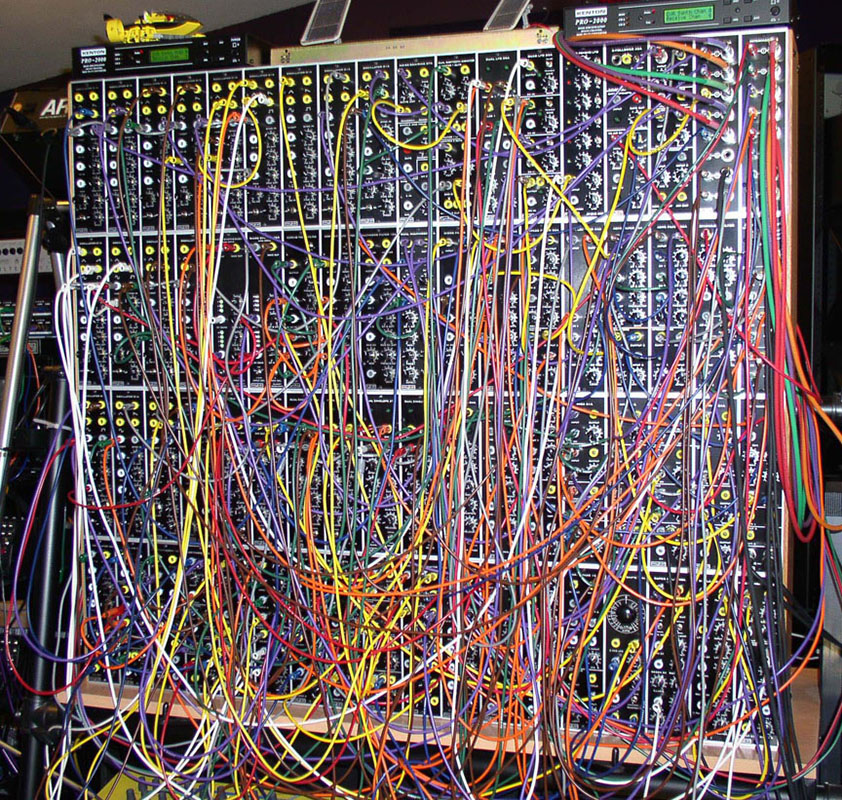

# What is MIDI?
MIDI is a layer-6 standard for serial communication developed in 1983. It was developed in part as a natural extension of the control voltage communication of modular synthesizers of the 1960s-70s. There were a few issues with these.

The most obvious one is that these cables take up massive amounts of space and can get messy very quickly. This is because each one can only carry a single signal, limiting its usefulness.

The second one is that there absolutely **had** to be a better way for two devices to communicate than through a massive chunk of wires. Using voltage control to make instruments communicate made sense when the main users of synthesizers were art musicians, but now people were wanting to use synthesizers more like pianos, with similar information being conveyed to multiple devices using a single controller.

Thom Holmes in *Electronic and Experimental Music* states that MIDDI was designed with "two basic applications in mind: connecting and controlling synthesizers ... [and] linking computers to synthesizers". To do this, it had to be fast and compact.

The designers of MIDI achieved this by making it an incredibly lightweight serial protocol. The standard MIDI signal consists of between two and three bytes, which can be encoded, transmitted, and parsed in minuscule amounts of time. 

In essence, every MIDI signal is telling a particular device to do a particular thing. Everything you can do with a piano, you can do with MIDI. For instance, there are signals dedicated to turning specific notes on, and there is a signal that frequently corresponds to the sustain pedal. This is not to say that a MIDI piano will sound as good as the real thing (it won't), just that the idea behind MIDI signaling is intuitive.
